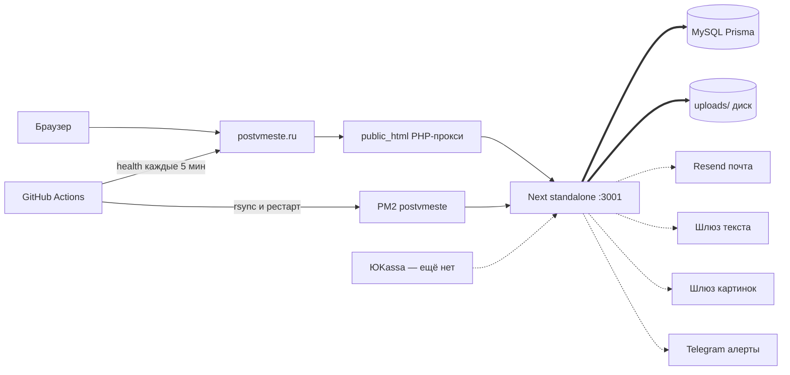
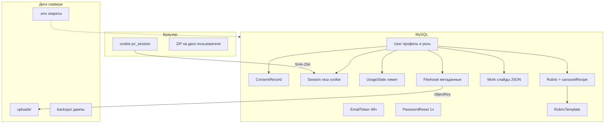
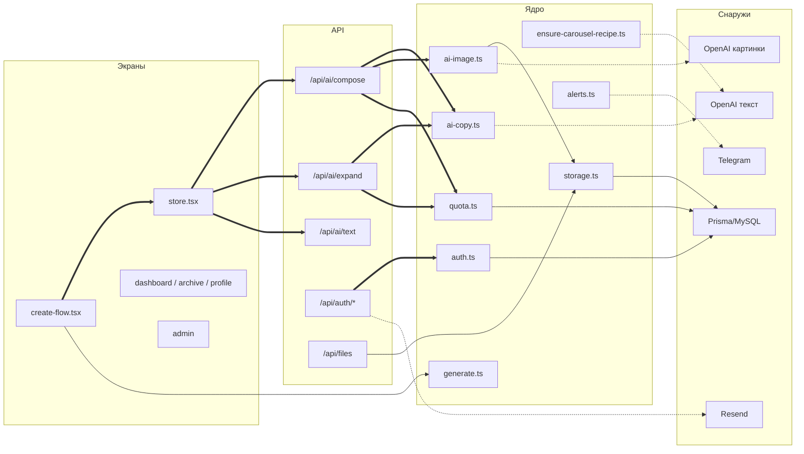
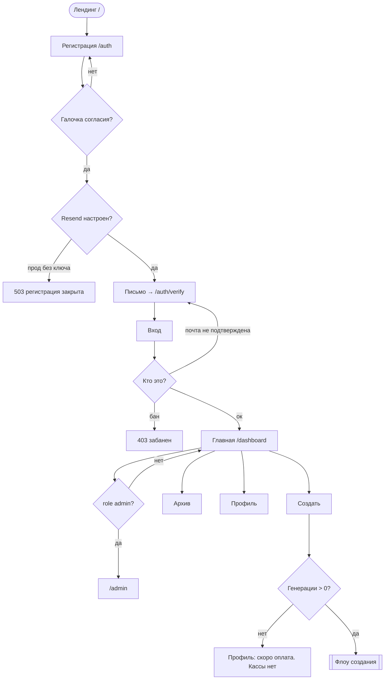
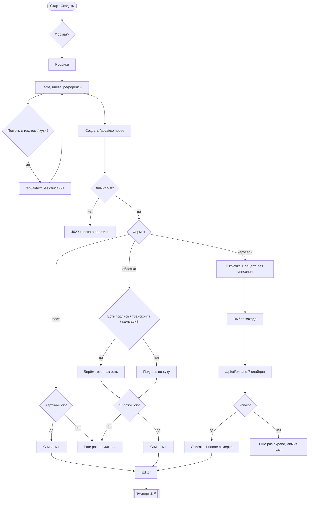
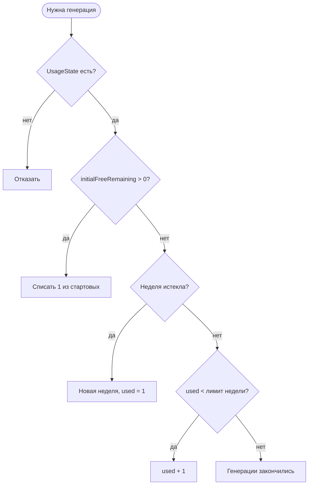
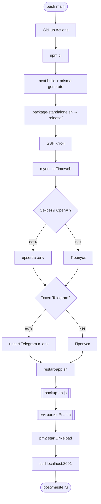
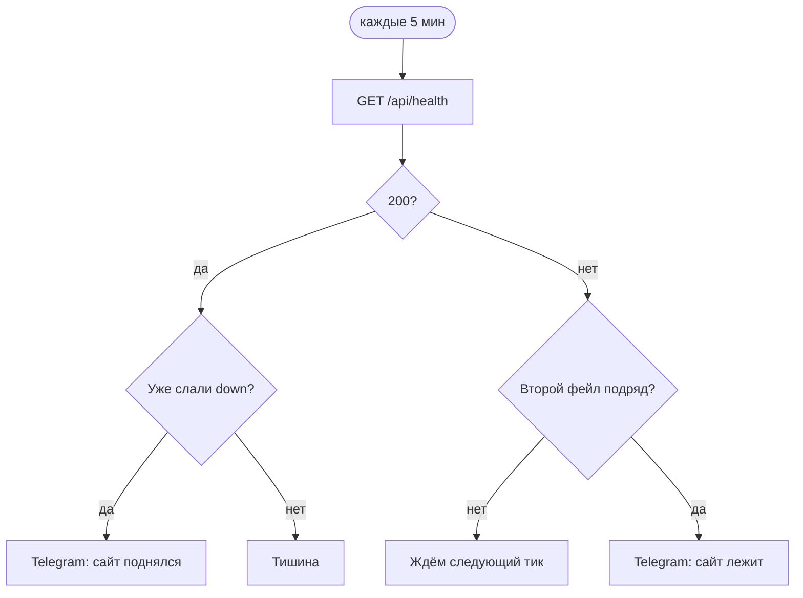
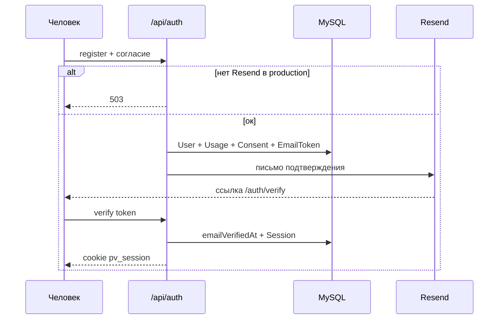
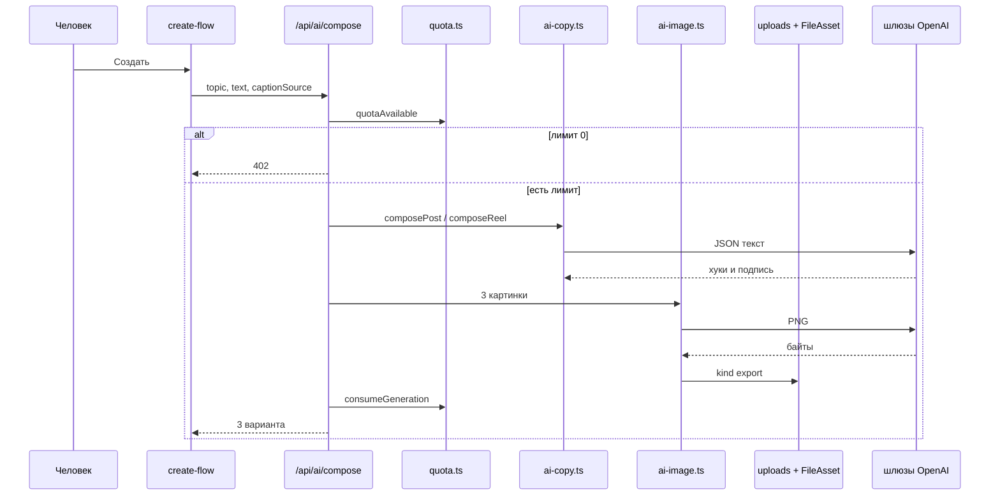

# Карта postvmeste.ru

Снимок студии на 8 сентября 2026. Собрано скиллами cartograph: `architecture-diagram`, `dependency-graph`, `workflow-diagram`, `data-flow`. Схемы смотреть в превью Markdown (GitHub / Cursor). Один холст «всё сразу» нечитаем — слои ниже.

Репозиторий: `generator-cash`. Прод: [postvmeste.ru](https://postvmeste.ru). Приложение: Next.js 16 standalone + Prisma/MySQL + PM2 на Timeweb, порт **3001**.

---

## 1. Где крутится система

Браузер не ходит в Node напрямую. Снаружи HTTPS, внутри Apache отдаёт PHP-прокси на `127.0.0.1:3001`.

| Узел | Где в коде / на сервере |
| --- | --- |
| Next | `src/app/*`, `output: "standalone"` |
| PM2 | `ecosystem.config.cjs`, `APP_PORT=3001` |
| MySQL | `prisma/schema.prisma`, `DATABASE_URL` |
| Диск | `src/lib/storage.ts` → `uploads/{userId}/{uuid}.ext` |
| Текст AI | `src/lib/openai.ts` → `OPENAI_*`, модель по умолчанию `gpt-5.5` |
| Картинки AI | `OPENAI_IMAGE_*`, модель `gpt-image-2` |
| Почта | `src/lib/mail.ts`, Resend HTTPS |
| Алерты | `src/lib/alerts.ts` + `telegram.ts` → [@mr_anderson_say](https://t.me/mr_anderson_say) |
| Деплой | `.github/workflows/deploy.yml` → `/home/c/<SSH_USER>/postvmeste` |
| ЮKassa | нет в коде; `POST /api/usage/tier` отвечает **403** |

Dev: `localhost:3000`. Прод снаружи: `https://postvmeste.ru`.

---

## 2. Где что хранится

Два мира: **строки в MySQL** и **байты на диске**. Cookie сессии в браузере, в БД только хеш.

### Таблицы

| Модель | Что внутри |
| --- | --- |
| `User` | почта, хеш пароля, `emailVerifiedAt`, ниша/аудитория/тон, цвета, `logoFileId`, `role`, `bannedAt` |
| `ConsentRecord` | версия оферты (`LEGAL_VERSION`), дата согласия |
| `Session` | хеш токена, срок 30 дней |
| `EmailToken` | подтверждение почты, 48 часов |
| `PasswordReset` | сброс пароля, 1 час |
| `UsageState` | тариф, лимит в неделю, `generationsUsed`, `weekStartedAt`, **остаток стартовых бесплатных** (`initialFreeRemaining`, старт 5) |
| `Rubric` | имя, цвета, ссылка вдохновения, JSON **рецепта карусели** |
| `RubricTemplate` | раскладка/сценарий/декор на пару `(рубрика, формат)` |
| `Work` | формат, тема, `slides` JSON, подпись, хештеги, цвета; поле `reelScript` в БД ещё есть, в UI больше не пишем |
| `FileAsset` | kind: `logo` / `reference` / `photo` / `export`; путь `objectKey` |

Картинки поста и обложки после генерации тоже `FileAsset` kind `export`, отдаются как `/api/files/{id}`.

### Что не в MySQL

| Место | Что | Переживает ли деплой |
| --- | --- | --- |
| `uploads/` | байты файлов | да, rsync `--delete` его не трогает |
| `backups/` | дампы перед миграцией, до 7 штук | да, в exclude |
| `.env` на сервере | `DATABASE_URL`, Resend, `APP_URL`, `ADMIN_EMAILS` | да, в exclude |
| GitHub Secrets | SSH, ключи OpenAI и Telegram | не на диске приложения |
| Actions cache | `.uptime-state.json` | состояние «сайт уже алертили» |
| Браузер | ZIP экспорта, черновик флоу | нет |

Загрузка файла: PNG/JPEG/WEBP, до 8 МБ. Референс на рубрику сбрасывает `carouselRecipe`.

---

## 3. Зависимости модулей

Стрелка `A --> B` значит «A зависит от B». Внешние сервисы — пунктир.

Кластеры по папкам (без gauntlet, группировка по каталогам):

| Кластер | Папка | Зачем |
| --- | --- | --- |
| Создание | `src/components/create-flow.tsx`, `reel-cover`, `carousel-slide` | шаги и редактор |
| Студия | `src/lib/store.tsx`, `studio.ts`, `serializers.ts` | гидратация ЛК |
| Генерация | `ai-copy.ts`, `ai-image.ts`, `generate.ts`, `openai.ts` | текст, картинки, варианты |
| Квота и доступ | `quota.ts`, `auth.ts`, `http.ts`, `admin.ts` | лимит, сессия, админка |
| Файлы | `storage.ts`, `export-package.ts`, `render.ts` | диск и ZIP |
| Деньги | `billing.ts` | заглушка, смена тарифа закрыта |
| Деплой | `.github/workflows`, `scripts/*` | сборка, rsync, health |

Самые «толстые» узлы: `create-flow.tsx` (UI всего флоу), `ai-copy.ts` (все тексты модели), `quota.ts` (любое списание).

---

## 4. Путь пользователя

Публичные страницы без входа: `/`, `/offer`, `/privacy`, `/support`, `/auth`, `/auth/verify`, `/auth/forgot`, `/auth/reset`.

ЛК без сессии → редирект на `/auth`. AI-роуты без подтверждённой почты → 403. Сессия с неподтверждённой почтой или баном сбрасывается.

После первой работы в архиве, если профиль не добит — попап «дополни профиль».

---

## 5. Этапы создания работы

Шаги в `create-flow.tsx`: `format → rubric → topic → variants → editor`.

### Разница форматов

| | Карусель | Пост | Обложка Reels |
| --- | --- | --- | --- |
| Списание на «Создать» | нет, только превью | после успеха | после успеха |
| Списание на expand | после 7 слайдов | — | — |
| Подпись | модель на expand | текст автора | свой текст или модель по хуку |
| Картинка | SVG кодом + рецепт | 3× `gpt-image-2` | 3× обложки 9:16 |
| ZIP | 7 PNG + `caption.txt` | `post.png` + `caption.txt` | `reel-cover.png` + `caption.txt` |
| Сценарий ролика | — | — | не даём |

«Помочь с текстом» / «Предложить хуки» лимит не ест. Ошибка модели → Telegram `generation`, списания нет.

---

## 6. Как тратится лимит

Стартовые 5 бесплатных тратятся первыми. На платном тарифе их остаток **складывается** с неделей.

Тарифы в продукте: free 1 / starter 10 за 50 ₽ / pro 50 за 200 ₽ / business 100 за 500 ₽. Самостоятельно тариф не сменить. Меняет админка.

---

## 7. Деплой

Триггер: push в `main` или ручной `workflow_dispatch`. Concurrent group `deploy-timeweb`, новый прогон отменяет старый.

`restart-app.sh` ещё пересобирает `public_html` прокси под порт.

**rsync не затирает:** `.env`, `uploads/`, `backups/`, входящие файлы upsert, `.uptime-state.json`.

Секреты только в GitHub Actions: SSH, `OPENAI_*`, `OPENAI_IMAGE_*`, `TELEGRAM_BOT_TOKEN`. На сервере руками: база, Resend, `APP_URL`, `ADMIN_EMAILS`.

---

## 8. Живой сайт и алерты

Ошибки генерации и заготовка «платёж не прошёл» — из приложения, не из cron.

---

## 9. Потоки данных

### Регистрация и вход

### Пост или обложка

Карусель на compose **не** списывает. Списание — после успешного expand.

---

## 10. Экраны и API

| Зона | Пути |
| --- | --- |
| Публичное | `/` `/offer` `/privacy` `/support` `/auth*` |
| Студия | `/dashboard` `/dashboard/create` `/dashboard/archive` `/dashboard/profile` |
| Админка | `/admin` |
| Auth API | `/api/auth/register` `login` `logout` `me` `verify` `forgot` `reset` |
| AI | `/api/ai/text` `compose` `expand` |
| Данные | `/api/works` `/api/rubrics` `/api/files` `/api/generations` `/api/profile` |
| Служебное | `/api/health` `/api/usage/tier` (403) `/api/admin/users` |

Админ в UI: `role === admin`. Админ в API: `authedAdmin()` + список `ADMIN_EMAILS` (при логине роль повышается).

---

## 11. Условия, которые легко забыть

1. Прод без Resend → регистрация 503.
2. Нет галочки согласия → регистрация 400.
3. Бан и неподтверждённая почта убивают сессию.
4. Карусель: превью бесплатно по лимиту, деньги/списание — за семёрку.
5. Пост без текста на шаге темы не стартует.
6. Обложка: свой текст/транскрипт/саммари не переписываем; пусто → подпись по хуку.
7. Референс залит или удалён → рецепт карусели сбрасывается, следующий compose снимет заново.
8. Картинка обложки: сначала 1024×1792, иначе квадрат.
9. Смена тарифа человеком закрыта, пока нет ЮKassa.
10. Алерт «сайт лежит» — только после **двух** провалов health подряд.
11. Стартовый бесплатный остаток на платном плане не сгорает — складывается с неделей.

---

## 12. Чего в карте ещё нет в коде

Это дыры продукта, не ошибки схемы:

- ЮKassa, вебхуки, чеки, экран оплаты
- «не нравится — перегенерировать» отдельной кнопкой
- хештеги поста из модели (сейчас локальные)
- саммари по вставленному видео рилса (план, п. 36)
- монтаж ролика, автопостинг, drag текста, логотип/фото в рендере
- Object Storage вместо локального `uploads/`

Живой план: `docs/work-plan.md`.
